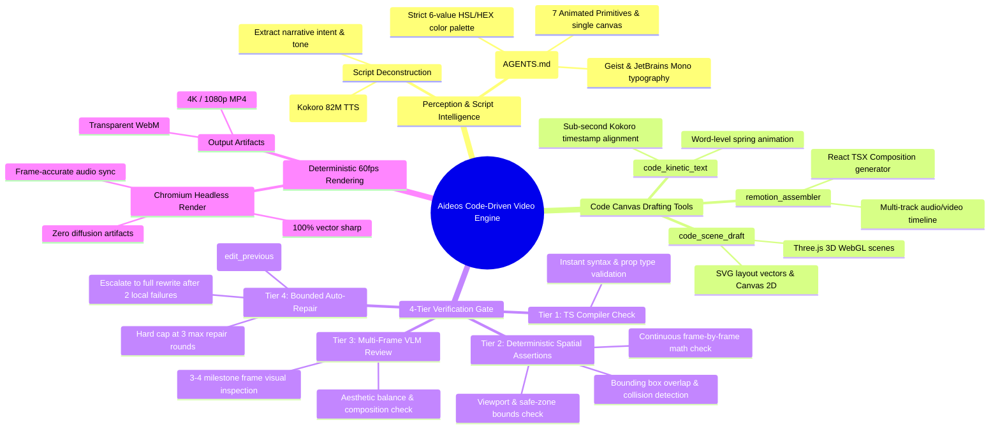
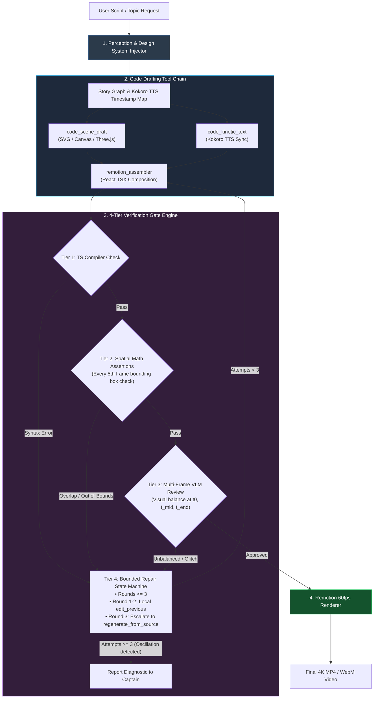

# Aideos Code-Driven Agentic Video Architecture Blueprint (v2.0)
> Inspired by GenClaw (arXiv:2605.30248) · Enhanced with Deterministic Spatial Assertions & Locked Design System Constraints

---

## 🗺️ Refined System Architecture Mind Map

---

## 🔄 Refined Execution & Verification Flowchart

---

## 🔬 Critical Analysis of Feedback: Accepted vs. Refined

| Feedback Item | Evaluation | Architectural Decision |
| :--- | :--- | :--- |
| **1. Deterministic Spatial Assertions** | **ACCEPTED (100%)** | Inserted Tier 2 math assertions (bounding box overlap, safe zone, off-screen checks) before calling VLM. Saves money, instant execution. |
| **2. Continuous Timeline Sampling** | **ACCEPTED & DUAL-TIERED** | Spatial assertions run frame-by-frame across the full timeline ($t_0 \dots t_N$). VLM vision inspection is reserved for 3-4 key milestone frames. |
| **3. Enforced Visual Identity** | **ACCEPTED & EXPLICIT** | Injected Aideos `AGENTS.md` design system rules (6-value palette, Geist/JetBrains typography, cubic-bezier easing) directly into the Perception phase. |
| **4. Bounded Repair State Machine** | **ACCEPTED & REFINED** | Hard cap at 3 repair rounds. Rounds 1-2 enforce local `edit_previous`; Round 3 escalates to `regenerate_from_source`. Prevents thrashing. |

---

## 🛠️ Updated Implementation Plan in `projects/aideos`

1. **Perception Module (`src/agent/perception.ts`)**:
   - Parses script and injects strict design system constraints (`#0A0A0B` background, `#F5F5F5` primary text, `#635BFF` accent, Geist/JetBrains fonts).

2. **Spatial Assertion Validator (`src/agent/spatial_assert.ts`)**:
   - Computes element bounding boxes across keyframes ($x, y, w, h$) to detect text overlaps, canvas overflow, or clipping deterministically without vision model calls.

3. **Multi-Frame VLM Evaluator (`src/agent/vlm_eval.ts`)**:
   - Takes 3-4 keyframe snapshots ($t_0$, $t_{\text{mid}}$, $t_{\text{final}}$) for aesthetic composition review once spatial assertions pass.

4. **Bounded State Machine (`src/agent/repair_machine.ts`)**:
   - Tracks repair attempts, prevents infinite thrashes, and escalates intelligently from local edits to full regeneration.
